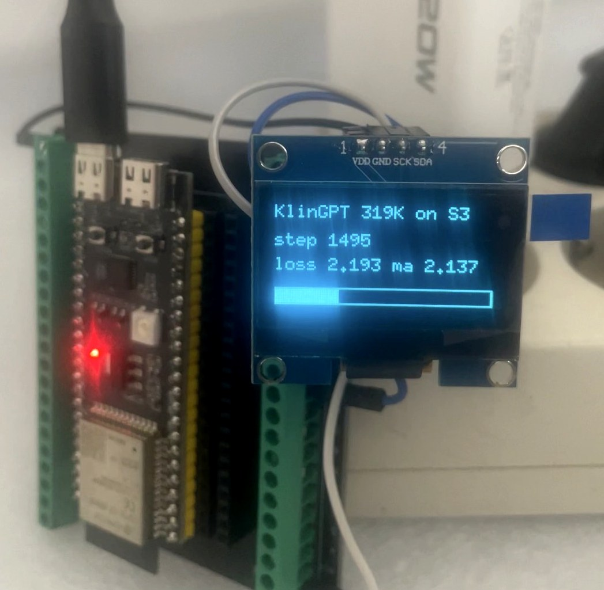
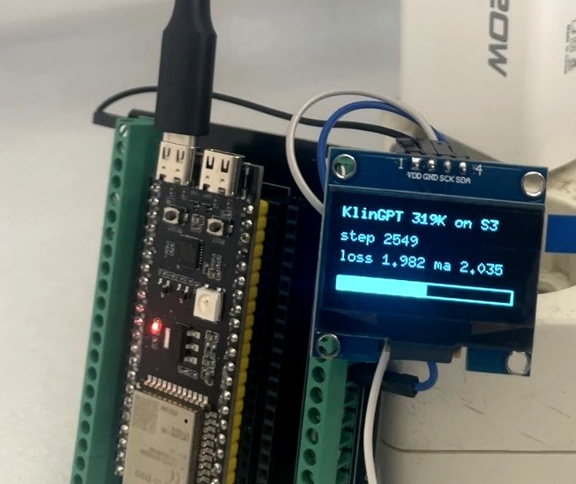
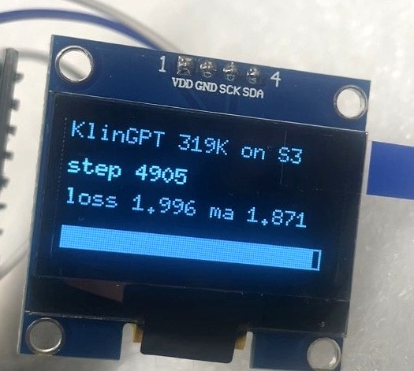
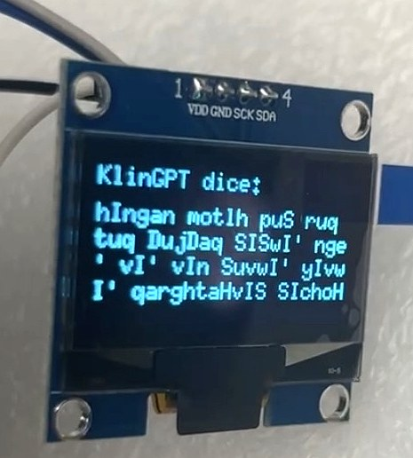

*Este texto ha sido redactado con asistencia de una IA. Ojo: asistencia no significa que lo haya escrito. Significa que ha corregido, revisado y completado algunas partes, pero el autor es humano (o eso creo).*

# Qapla' Project
## Así se entrena un transformer desde cero en un ESP32-S3 de 8 pavos.

*El GPT (en Klingon) que nadie pidió pero todos necesitábamos.*



**¿Y por qué lo necesitábamos?** Porque damos por hecho que entrenar un modelo requiere una GPU o un datacenter. Y no siempre: a veces basta algo tan pequeño y barato como un micro de 8 pavos para entrenar uno desde cero.

**Vuelve a leer: entrenar desde cero.**
No ejecutar un modelo pre-cocinado. Entrenar. Forward, backprop y actualización de pesos, dentro del chip.

## ¿Qué es Qapla'?

La IA en el edge no es nueva. TinyML lleva años haciendo inferencia en microcontroladores, los ports de llama2.c de Karpathy metieron transformers de ~260K parámetros en un ESP32, y hace nada un proyecto brillante logró correr un modelo de casi 29 millones de parámetros en un ESP32-S3 de 8 dólares. Son trabajos excelentes, y aunque casualmente se han solapado en el tiempo con este experimento, no han sido nuestro modelo a seguir.

El proyecto [esp32-ai](https://github.com/slvDev/esp32-ai) de Slava S. (slvDev) y otros similares comparten una cosa: son inferencia. El modelo nace en otro sitio (una GPU, un datacenter), se entrena con sus datos, se cuantiza, y solo entonces se carga en el chip para que lo ejecute. El cerebro se cocina fuera y se sirve dentro.

Nosotros nos hicimos otra pregunta: ¿y qué pasa cuando el modelo no puede nacer fuera? ¿Qué pasa cuando no puede venir pre-entrenado, porque los datos que necesita aprender no existen hasta que el dispositivo está en su sitio, no puede llevarlos cargados, o no tiene internet para descargarlos?

Sabemos que te estás preguntando: "Vale, pero... ¿por qué iba a necesitar alguien entrenar un transformer en un ESP32?". Y es una buena pregunta. A lo mejor la respuesta es "para nada". Pero... puestos a ponernos creativos, imagina esto: un sensor pegado a una máquina agrícola en mitad del campo, que tiene que aprender la vibración normal de esa máquina concreta (distinta a la de cualquier otra del mundo) para detectar cuándo algo va mal y hacer mantenimiento preventivo (y no, no me vas a pillar: he dicho que no hay internet, pero... ¿LoRa? ;). O piensa en un sensor en una parcela que aprende cómo se seca ese terreno concreto (su suelo, su sol, su drenaje) y predice cuándo tocará regar, antes de que la planta sufra. En esos casos (y otros que se nos ocurren) los datos no existían hasta que el dispositivo se instaló: nadie pudo pre-entrenarlos. El chip tiene que aprender sobre la marcha, solo, ahí donde está.

Nosotros no tenemos una máquina agrícola a mano para experimentar. Así que, para poner a prueba la capacidad de aprendizaje real de un ESP32, diseñamos el experimento con lo único que sí teníamos: el lenguaje. ¿Hasta dónde puede llegar un chip de 8 pavos aprendiendo un idioma desde cero, sin ayuda de nadie?

## ¿Qué implica entrenar en un micro?

Entrenar dentro de un micro de 8 pavos impone reglas del juego que un datacenter no tiene. Y esas reglas condicionan todo lo demás:

**Una vez más, la memoria manda.** Un ESP32-S3 tiene unos pocos MB de RAM/PSRAM, no gigabytes. Eso pone un techo al tamaño del modelo: aquí hablamos de cientos de miles de parámetros, no de millones. Un modelo que "cabe" y se entrena en el chip es, por fuerza, pequeño.

**El modelo pequeño manda sobre la tarea.** Un modelo de este tamaño puede aprender la *estructura* de un idioma (cómo se forman las palabras, la fonotáctica, algo de gramática), pero no la *semántica* profunda de una lengua entera. La tarea tiene que estar a la medida del modelo.

**Y el corpus manda sobre el resultado.** Con un modelo pequeño no necesitas gigabytes de texto. Necesitas un corpus compacto, limpio y con estructura. Y, si vas a publicarlo, lo necesitas libre de líos de copyright.

Junta las tres restricciones (modelo pequeño, tarea acotada, corpus limpio y compacto) y la pregunta se vuelve concreta: *¿qué idioma cumple todo eso a la vez?*

Podría decirte que hicimos un brainstorming para decidir con qué idioma podríamos experimentar en esta primera fase, pero a veces es mejor ceñirse a aquello de "la primera idea suele ser la buena"… y en este caso concreto, la primera lengua que se nos vino a la cabeza… fue el **Klingon.**

## El lenguaje Klingon

Sí, Klingon. El idioma de los guerreros de *Star Trek*. Y si sigues leyendo descubrirás que la elección tiene menos de friki y más de ingeniería de lo que parece.

El Klingon no es un galimatías que escupe palabros que suenan a alienígena y ya. Lo creó el lingüista Marc Okrand en 1984, y es una lengua construida con fonología, gramática y morfología sistemáticas: tiene un orden de palabras poco común (objeto-verbo-sujeto) y una morfología con sus reglas estrictas. En otras palabras: tiene estructura real que aprender, que es justo lo que necesita un modelo pequeño para demostrar que aprende de verdad y no memoriza ruido.

Y encaja con nuestras restricciones:

- **Estructura rica, vocabulario acotado.** Suficiente gramática para que el modelo tenga algo que capturar, pero un corpus lo bastante pequeño como para caber en las reglas del micro.
- **Alfabeto reducido.** Trabajando carácter a carácter, un vocabulario de ~30 símbolos mantiene el modelo diminuto —justo lo que manda la memoria del ESP32—.
- **Corpus limpio y libre.** Existe un diccionario comunitario con licencia abierta (boQwI'), así que podíamos entrenar y compartir sin pisar terreno legal ajeno.

Dicho de otro modo: el Klingon es un campo de pruebas ideal. Un idioma de verdad, con gramática de verdad, pero de un tamaño que cabe en la palma de la mano. El laboratorio perfecto para exprimir el motor antes de llevarlo, quizá en otra fase del proyecto, a otros idiomas minoritarios reales, con hablantes reales. ¿Sami? ¿Quechua? ¿Náhuatl? Eso… es otra historia.

Ah, y sí: hay que reconocer que mola. Que un chip low cost susurre Klingon en una pantallita OLED de 1,3" tiene algo de friki, pero también algo de magia. Pero eso… solo es el bonus.

**qapla'.** *(En Klingon: "éxito". Nos pareció el nombre correcto.)*

## Qué NO es (seamos sinceros)

Para que nadie se lleve una idea equivocada, y porque el rigor importa:

**No es un ChatGPT de bolsillo.** No conversa, no responde preguntas, no razona. Es un modelo generativo diminuto que aprende la *forma* de un idioma, no su significado.

**No genera Klingon semánticamente perfecto.** Aprende estructura —prefijos, sufijos, orden de palabras, cómo suenan las frases— y produce texto que *parece* Klingon y respeta muchas de sus reglas. Pero no esperes frases con sentido pleno que un klingonólogo aprobaría sin reparos (si alguien en la Enterprise recibiera un mensaje de nuestro ESP32, probablemente acabaría provocando un conflicto diplomático). Y en cualquier caso, ni existe suficiente Klingon en el mundo para lograrlo, ni cabría en el chip el modelo que haría falta.

**No es inferencia disfrazada.** No hay ningún modelo pre-entrenado escondido. El chip arranca con pesos aleatorios y sin conocimiento previo del Klingon, y aprende desde cero. Lo que ves es aprendizaje real, no un modelo cocinado en otro sitio y servido aquí.

**No es rápido.** Seamos serios: lo hemos repetido hasta la saciedad pero… ¡es un micro de 8 pavos, no una GPU! Entrenar lleva horas. Esa es justo la gracia: que sea lento y aun así funcione.

Lo que **sí** es: la prueba de que un microcontrolador humilde y con espíritu maker puede entrenar un modelo de lenguaje desde cero, íntegramente a bordo. Ni más, ni menos. Que no es poco.

## Cómo funciona

Aquí está lo que de verdad importa, y lo que puedes verificar tú mismo en el código. Todo el ciclo de aprendizaje ocurre a bordo:

**Dentro del ESP32-S3:**
- ✓ Inicialización aleatoria de los pesos (atento al seed, ejem)
- ✓ Lectura y tokenización del corpus
- ✓ Forward pass
- ✓ Cálculo de la loss (cross-entropy)
- ✓ Backpropagation (gradientes derivados a pelo)
- ✓ Actualización de pesos (SGD con momentum + cosine LR)
- ✓ Guardado del mejor modelo en flash (LittleFS)
- ✓ Generación de texto con los pesos aprendidos

**Fuera del ESP32-S3:**
- ✗ Nada.

### La arquitectura

No hay nada nuevo aquí. Es un transformer minúsculo pero completo: un bloque, atención causal de una sola cabeza, embeddings atados (*tied weights*), FFN con ReLU y LayerNorm. Trabaja carácter a carácter, con un vocabulario de ~31 símbolos. En total, **~319.000 parámetros**.

### El backprop, a mano

Aquí no hay PyTorch ni autograd. Cada derivada del forward pass está escrita explícitamente en C. Para asegurarnos de que no había errores, contrastamos numéricamente esos gradientes contra una implementación de referencia en PyTorch (*gradient checking*) antes de meterle mano al chip. Es la parte más delicada y la que más mola ver funcionando.

### La proeza no son los parámetros: es la memoria

Un modelo de 319K parámetros "solo" ocupa ~1,3 MB. Pero **entrenar** no es solo tener los pesos. Hace falta, a la vez y en memoria: los pesos, una copia igual de grande para los gradientes, otra para el momento del optimizador, otra para guardar el mejor modelo, más todas las activaciones intermedias que el backward necesita, más el corpus. En total, varios MB en la PSRAM del chip.

Esa es la diferencia real entre *inferir* (te basta con los pesos) y *entrenar* (pesos + gradientes + momento + activaciones). Y es justo lo que hace este proyecto distinto: no guarda un modelo para ejecutarlo, lo **entrena** con todo lo que eso arrastra.

## Reprodúcelo

Este repo publica el **motor**, no el corpus. La gracia está en que el chip aprenda *tu* texto, así que el corpus lo pones tú.

**Lo que necesitas:** un ESP32-S3 con PSRAM (el N16R8), una OLED SH1106 por I2C (opcional, pero es media diversión), y PlatformIO.

```bash
# 1. Tu corpus, en texto plano (una muestra por línea)
python tools/gen_header.py mi_texto.txt src/corpus_klingon.h

# 2. Compila y flashea
pio run -t upload

# 3. Míralo aprender: la loss bajando en directo
pio device monitor
```

Y ya está. El chip arranca con pesos aleatorios, entrena, guarda el mejor modelo en flash y, al siguiente arranque, lo carga y genera. Si lo desenchufas a mitad, pierdes lo aprendido desde el último checkpoint; si lo desenchufas después de terminar, el cerebro sigue ahí.

**Un aviso:** esto tarda horas. Muchas. Incluso días. No es un bug: es entrenar un transformer de cero en un ESP32-S3 de 8 pavos.

## Los números

Todo esto ocurrió dentro del chip, alimentado por un cargador de móvil.



| | |
|---|---|
| **Parámetros** | ~319.000 |
| **Vocabulario** | 31 caracteres |
| **Contexto** | 32 caracteres |
| **Optimizador** | SGD con momentum (0.9) + cosine LR |
| **Pasos** | 5.000 |
| **Duración** | ~2 días enchufado a un cargador |
| **Hardware** | ESP32-S3 N16R8 + OLED SH1106 |

Y la loss bajando, tal cual se veía en la pantalla:

| Paso | loss (batch) | media móvil |
|---|---|---|
| arranque | 2.298 | 2.216 |
| 1.495 | 2.193 | 2.137 |
| 2.549 | 1.982 | 2.035 |
| 4.905 | 1.996 | **1.871** |



La media móvil es la que importa: la loss de cada batch salta mucho (depende de qué frases le tocaran), pero la media baja de forma sostenida. **El chip terminó en ~1.87.**

### Y esto es lo que escupe



```
hIngan motlh puS ruq tuq DujDaq SISwI' nge'vI'
vIn SuvwI' yIvwI' qarghtaHvIS SIchoH
```

No es Klingon con sentido pleno —ya avisamos—, pero mira la morfología:

- **`SuvwI'`** es *guerrero*: la raíz `Suv` (luchar) más el sufijo `-wI'` ("el que hace"). Palabra real, bien construida.
- **`DujDaq`** es *en la nave*: `Duj` (nave) más el sufijo locativo `-Daq`.
- **`qarghtaHvIS`** lleva `-taHvIS` (*mientras*, continuo + adverbial), un sufijo compuesto pegado donde toca.
- Y **`hIngan`** se queda a dos letras de `tlhIngan`, que es literalmente la palabra "klingon".

Otras palabras están bien formadas pero no existen: el modelo aprendió las **reglas**, no el diccionario. Que es exactamente lo que dijimos que haría.

Nadie le enseñó esos sufijos. Los dedujo solo, carácter a carácter, dentro de un micro de 8 pavos.

## Y de aquí, ¿a dónde?

Cualquiera con tiempo, curiosidad y ganas puede escribir un backprop a mano y entrenar un modelito en un micro. Eso no es lo raro.

Lo interesante viene después: llevar el motor al límite con una tarea de verdad, un idioma real con hablantes reales y un corpus mucho más grande del que da el Klingon. Ahí se acaba el laboratorio y empieza la ingeniería de verdad: que un modelo más capaz quepa y aprenda en un chip que no ha crecido.

Tenemos alguna idea. Pero eso, si llega, será otra historia.

## Licencia

Código bajo **Apache 2.0**. Cógelo, tócalo, métele tu idioma.

---

*Todo el corpus de entrenamiento proviene de fuentes con licencia libre (boQwI' / klingon-assistant-data, Apache 2.0). El idioma Klingon fue creado por Marc Okrand; Klingon, Star Trek y marcas asociadas son propiedad de sus respectivos titulares (CBS Studios / Paramount). Este es un proyecto educativo y de investigación de código abierto, sin afiliación ni respaldo de dichos titulares. Ver [CORPUS.md](CORPUS.md) para el detalle de fuentes y licencias.*

*Ah, y la semilla del generador de números aleatorios es 1701. Si no sabes por qué, este no es tu repo.*
